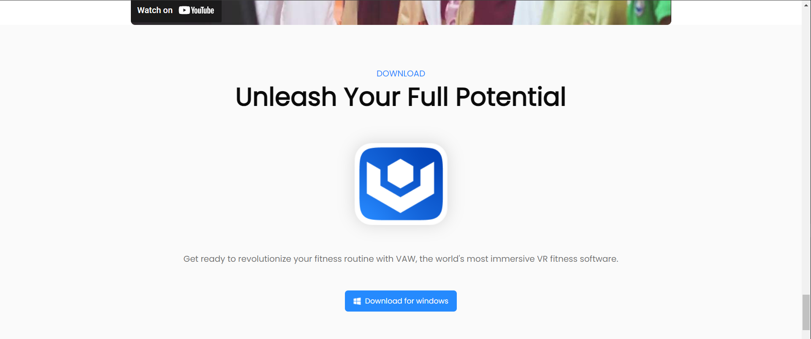
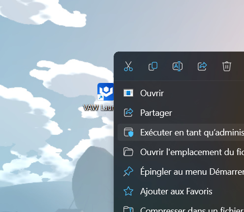
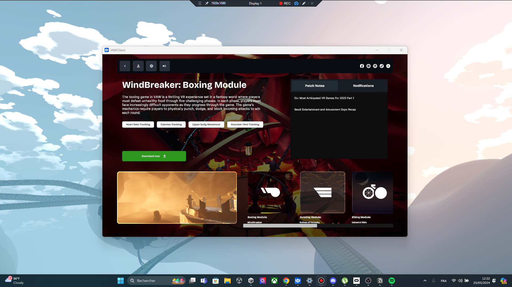
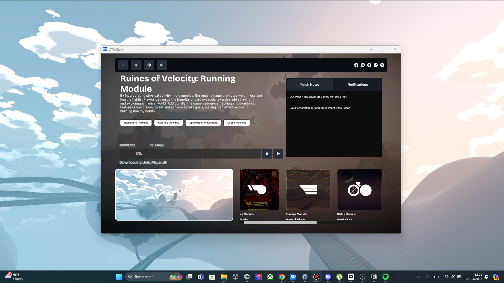

# Installation

### **Download the Game**

- Visit the VAW [Website](https://www.vaw.training/) and navigate to the download section.
- Click on the provided link to download the game installer.

### **Antivirus Flagging**

- Your antivirus might flag the installer as a virus. This is a common occurrence due to the frequency of downloads. Ignore this warning and proceed with the installation.

### **Installation Process**

- Once downloaded, install the client.
- During installation, ensure to run the installer as an administrator for smooth installation.

### **Running the Game**

- After installing the client, launch it as an administrator.
    
    
    
    Main VAW Client Interface
    
- This step grants you the ability to download the game to your system.
    
    
    

### **Registry Update**

- Once all games are downloaded, run each one at least once.
- This updates your registry with their corresponding deep linking URI.

### **Account Dashboard**

- Visit your account on our [Dashboard](https://app-staging.vaw.training/).
- Follow the instructions provided on the dashboard for further guidance.

### **ANT+ Drivers**
You can download the drivers from the official website [here](https://support.wahoofitness.com/hc/en-us/articles/360021559679-Installing-ANT-drivers).