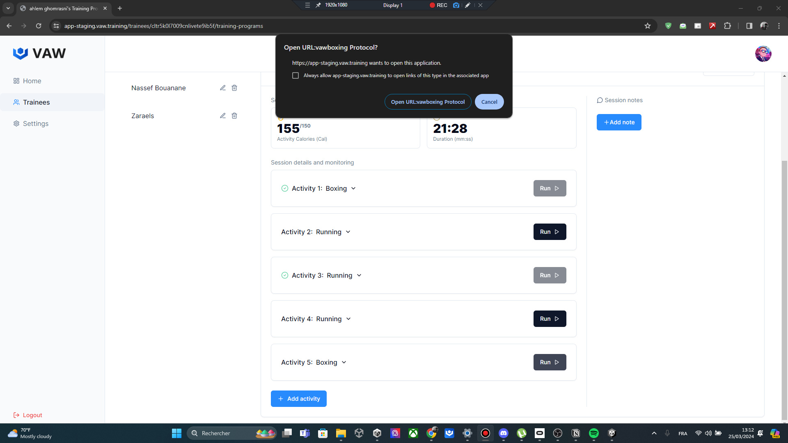
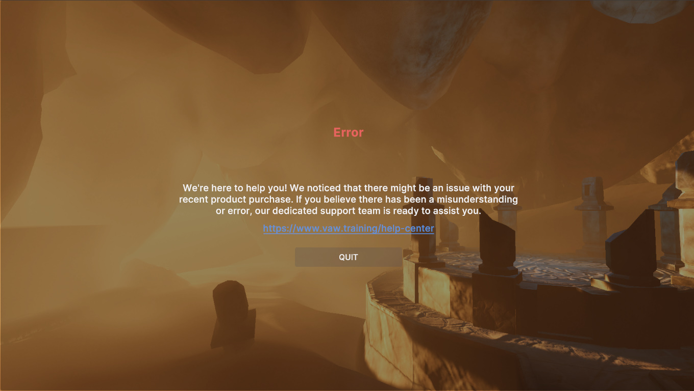

# Launching The Games

After setting your inputs and intensity of the exercice as mentioned in the Dashboard section you can simply select an activity and run it. During runtime, the game will receive your input and convert it into a game parameter. It will then dynamically adjust the intensity of the exercise accordingly.

## Failure Screen

In some cases, you may encounter a failure screen

This indicating one of two possible issues:

1. **Launching Without Dashboard**: Trying to start the game without using the dashboard. The game requires initialization with input from your side via the dashboard to proceed.
2. **Internet Issues**: Connectivity problems with the internet. Since a continuous internet connection is necessary for smooth data flow between each game and the dashboard, any interruptions may result in a failure to launch.

If neither of these scenarios appears to be the problem, please feel free to contact our support team. We are always available to assist and resolve any issues you may encounter.