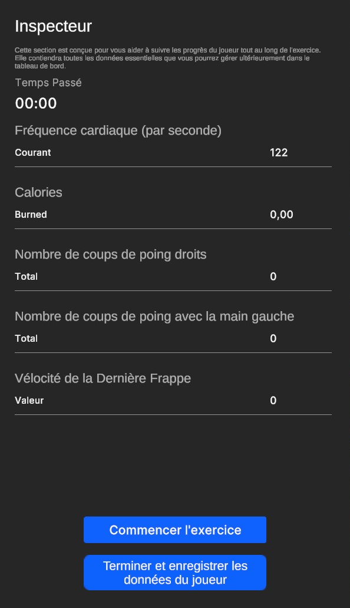
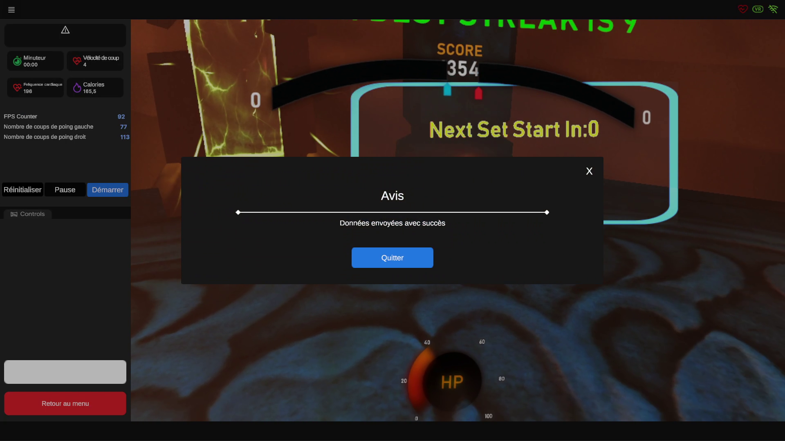

# Session Handling

Although the user interface may differ a bit between the projects, it generally follow the same structure which consists of :

1. **Launching the Session**: Initiated by clicking the start button in the presented User Interface.
    
    
    
2. **During the Session**:
    - **Set Time Management**: Handling the number of sets, their duration, and saving set data.
    - **Difficulty and Intensity Adjustment**: Dynamic adjustment of exercise intensity values during runtime.
    - **Safety Pause**: Pausing the game if the trainee reaches a critical heart rate value to ensure safety.
    - **Rest Time and Set Switching**: Managing rest intervals and transitioning between sets.
    - **Metrics Calculation**: Calculating metrics such as calories burned, average heart rate, and game-specific metrics. Providing data for later graphing in the dashboard.
3. **Ending the Session**: Sending data back to the server and exiting the game.
    
    
    

**Please Note:**

While it is possible to save data at any time during the game, we highly recommend waiting until all the sets you entered are completed to obtain the most accurate measurements in your dashboard.