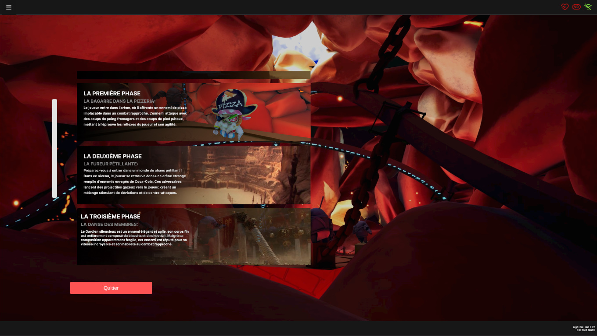
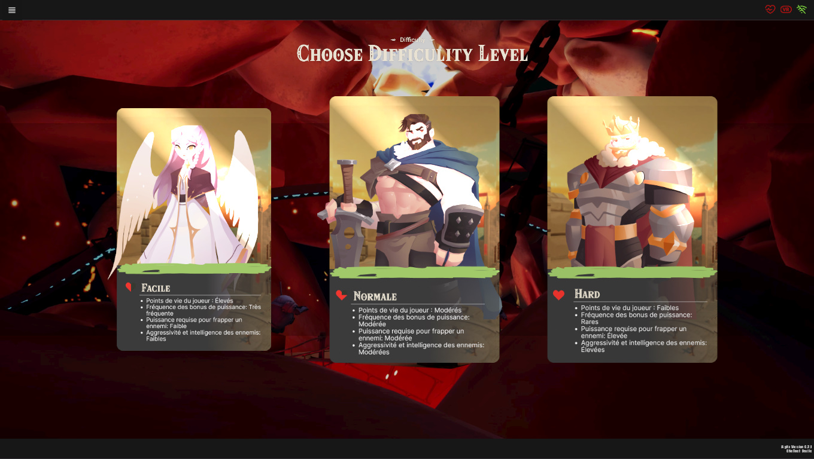

Each of our games adheres to the same structure, beginning with a title screen. This serves two main purposes:

- **Ease into VR**: The title screen provides a gentle transition into the VR game, giving the trainee a moment to acclimate before the exercise begins.
- **Doctor Control**: It offers doctors a level of control over the game settings, allowing them to adjust parameters as needed.

Following the title screen, each game presents a variety of levels and difficulties. This flexibility enables you to choose the settings that best suit the trainee's needs and desired level of effort.

After selecting a level and a difficulty preset, you are ready to proceed and conduct your session with your trainee.