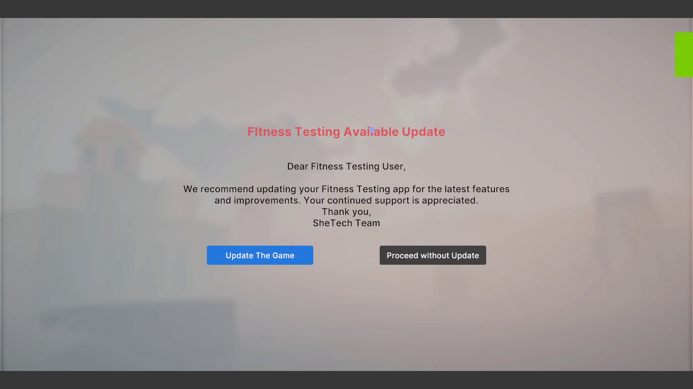
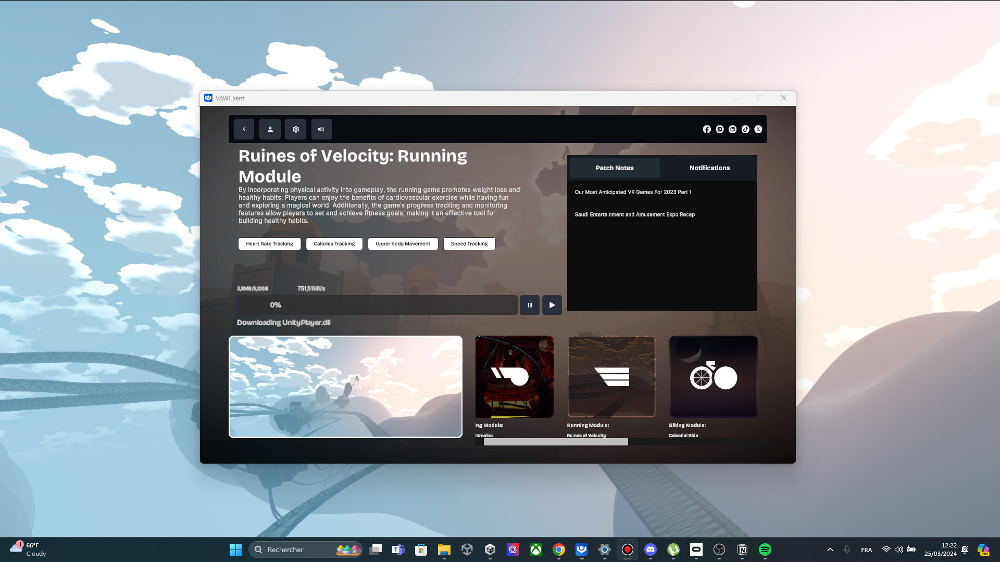

# Updating a Game

When you initially launch a game, it will run a background check to determine if there are any updates available on our servers. Depending on the result of this check, it will display a screen accordingly.

While you have the option to ignore the updating process entirely, it is always recommended to download the latest updates and patches. Doing so ensures that your games remain up-to-date, providing access to the latest versions and features. These updates often include new content, bug fixes, and overall enhancements, resulting in a better experience.

If you do happen to update the game it will automatically launch the VAW Launcher and it will download the latest updates

.