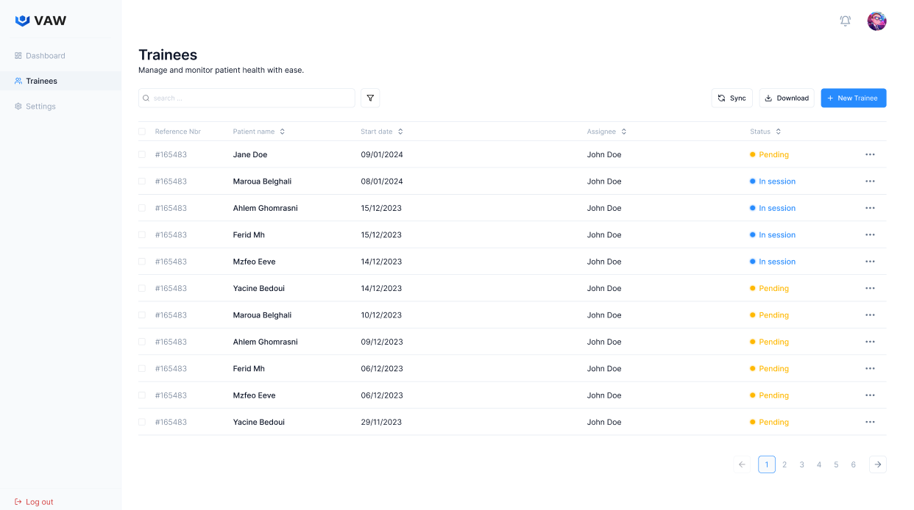

# VAW Dashboard

Welcome to Virtual Adventure Workout (VAW), your gateway to an unparalleled fitness experience. In this immersive onboarding journey, we'll introduce you to the exhilarating world of VAW, where virtual reality seamlessly intertwines with physical activity, elevating your fitness routine into an exciting adventure.

# **Dashboard Introduction**

Before we dive into the exhilarating world of VAW, let's start by familiarizing ourselves with the VAW dashboard. To access all the exciting features and activities VAW has to offer, the first step is to **sign in using your email and password.**

# **Forgot Password**

In case you've forgotten your password, don't worry! Simply **click** on the "**Forgot Password?**" link , we'll guide you through the steps to reset your password and regain access to your VAW account.

After **clicking** on "**Forgot Password?**", you'll be directed to the password recovery page. Here, you'll need to enter the email address associated with your VAW account. Once you've entered your email, **click** on the "**Send**" button.

**Please ensure that you enter the correct email address.**

# **New Password Creation**

After entering your email and receiving the password reset instructions, you'll be prompted to create a new password. Choose a strong password that meets our security requirements, and enter it into the designated field. Once **you've confirmed your new password**, **click** on the "**Continue**" button to finalize the password reset process.

# **Post-Login Navigation**

Once you've successfully logged in, you'll be directed to one of three main areas: **Home**, **Trainees**, or **Settings**. Each area serves a distinct purpose to help you make the most of your VAW experience.

# **Adding New Trainee**

To add a new trainee to your VAW account , enter the trainee's details.

Once you've filled out all the necessary information, click on the "**Create**" button to finalize the process.

# **Trainees**

Upon clicking on "**Trainees**," you'll find a comprehensive list of all registered participants. 

Here, you can view and manage individual profiles, including progress and performance.

# **Trainee Overview**

Upon selecting a trainee, such as "Jane Doe," you'll be directed to a detailed **Overview** of her profile.

# **Medical Information**

For a detailed view of medical records, **navigate to** "**Medical Information**" and **click on**                      "**Medical Records**" Here, you'll find recorded dates along with vital health metrics, including:

- **Weight**
- **Height**
- **BMI (Body Mass Index)**
- **Resting Heart Rate**
- **Blood Sugar**
- **Systolic Blood Pressure**
- **Diastolic Blood Pressure**

You can also gain insights into "**Blood Pressure Levels**", where you'll find an explanatory bar chart illustrating fluctuations over time.

You'll also find a "**Weight Over Time**" graph, illustrating changes in weight over a period.

Finally, you'll discover a "**Body Mass Index (BMI)**" graph, depicting fluctuations over time.

# **Fitness Assessment**

You'll also encounter another button labeled "**Fitness Assessment**"

When you select the date, **click on** the "**Assessments list**" button such as the date                    **"February test 1”** Here, you'll find detailed results regarding activity calories burned and duration. Moreover, you have the option to select activities like **Boxing**, **Running**, and **Cycling**. 

On the right side, you can add notes by clicking the "**Add note**" button.

If you want to add a new assessment, simply **click on** the "**New Assessment**" button, and the next block will be displayed

If you want to edit an assessment, hover over the date you want to change, and **click** on the **pencil icon**. The corresponding block will then be displayed

# Training Programs

Within the "**Training Programs**" section, you gain access to detailed session insights and activity monitoring across a range of exercises, encompassing boxing, running, cycling, as well as designated rest intervals.

To add a new session, simply click on the "**New Session**" button. In fact, a block like this will appear.

If you want to **edit** something, you **click on the pencil icon** **next to the trainee's name**, and a block like this one will appear.